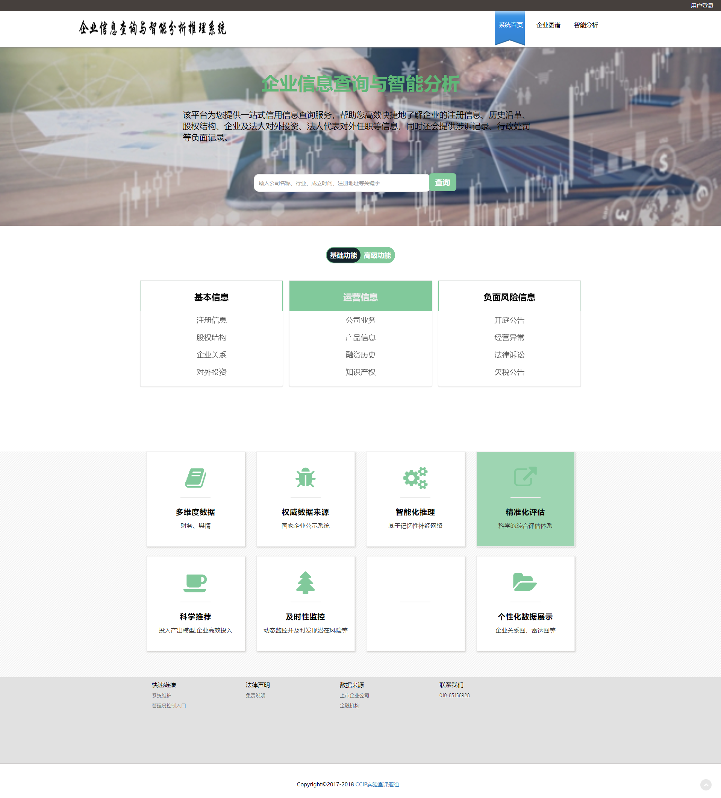

# Enterprise_Credit_Analysis
    一个集企业信息查询、数据分析、推理、评估、预测企业信用可视化分析平台
    下阶段会基于知识图谱、机器学习算法、深度神经网络进行风险评估及关联关系推理
##### 第一阶段研发工作【170901--180601】
#### 平台架构
1. 系统架构主要分为：企业信息查询模块、智能分析模块、系统后台模块、企业关系分析模块
#### 企业信息查询模块
1. 用户登录、注册
2. 基本信息查询
#### 智能分析模块
1. 基于DEA科研投入推荐模型实现.【后台通过MATLAB进行计算，Java调用模型在系统使用】
2. 基于决策树实现企业信用等级评估模型.通过四分位图直观展示企业指标是否异常及处于行业水平位置。利用ANN网络进行评级。
3. 三大行业动态预测【全国房地产、汽车、软件信息服务业相关指数及可视化】
4. 基于DEA的企业风险模型，从财务风险、经营风险、技术风险、战略风险四维一级指标进行刻画。
5. 贷后预警模型

##### 第二阶段研发工作【180613--180830】
#### 基于深度学习的金融分析
1. 基于深度神经网络进行分析预测。
2. 利用CNN、LSTM等神经网络进行分类和预测。
3. 截止目前已实现企业信用评级、行业动态预测、企业风险评估的算法实现，基于TensorFlow深度学习框架，主要设计CNN、LSTM、VGG等模型。
4. 已实现测试通过TensorFlow保存CNN(卷积神经网络、LSTM(长短期记忆网络)等训练模型pb文件，经Java调用，供Web端调用,测试实现代码。
5. 实现企业信用评估CNN模型pb文件的Java Web端的使用。利用Jfinal的上传文件接口在前端上传测试数据.csv文件，后台接收后读取数据并使用模型进行预测并返回评级结果。[参考代码--613行左右处可见](https://github.com/lihanghang/Enterprise_Credit_Analysis/blob/master/src/com/ccip/bank/user/PredictController.java)
6. 五大TFModel全部调用过程封装[代码](https://github.com/lihanghang/Enterprise_Credit_Analysis/blob/master/src/com/ccip/bank/model/TFModelPred.java)查看.根据项目进度不
7. 实现基于LSTM模型的Java调用。
8. ……………………………………

##### 第三阶段研发工作【180901--181101】
总体目标：基于第二阶段研发工作，在神经网络算法中加入“记忆模块”、“注意力机制”等；企业知识图谱核心技术突破及初步实现。

#### 企业知识图谱模块
1. 基于RDF构建企业信息知识库
2. 使用SPARQL、Jena进行RDF的相关操作。
3. 数据存储包含传统关系数据库及RDF图数据库
4. 企业基本信息展示及与其他企业关系、任务关系等

#### 系统后台模块
 1. 登录、注册  
 2. 增加后台对用户、管理员管理
 3. 数据上传接口
 4. 用户权限管理
  
***
### 系统局部展示
#### 首页

***
## 问题记录

#### 
1. 远程代码至temp：git fetch origin master:temp
2. 地代码进行比较： git diff temp
3. 地代码合并：git merge temp
4. 本地 temp分支（可选）：git branch -d temp
5. 通过java调用MATLAB，进行复杂数据计算和相关算法实现。
6. 更新本地仓库代码：git pull.
7. 删除分支：git push origin : branch_name(您需要删除的分支名)。
8. java调用MATLAB封装的函数及神经网络函数。
9. MATLAB 编译为jar文件，供java使用，对于复杂的数据处理过程可以采用此思路，可迅速解决问题。但
可能在速度方面有可能不佳。
10. 当用java调用TensorFlow 训练的模型文件pb时，可能在输入数据需要归一化或标准化处理，这是我们可以考虑
使用MATLAB先做一个处理过程的封装。
11. 使用基于Conda的Jupyter进行模型行训练时出现kernel dead error时，可在环境中执行conda install mkl命令，可解决问题。
12. ……………………………………
***
- 欢迎交流，邮箱lihanghang@ucas.ac.cn
- [个人网站](https://www.lihanghang.top/)
- 更新时间：2018.10.11
 